作为移动端App来说，动画效果是页面切换和用户交互过程中不可缺少的一部分，优雅炫酷的动画可以提升App整体的质量，给用户带来赏心悦目的使用体验。[Jetpack Compose](https://developer.android.com/jetpack/compose)作为Google官方最新推出的UI开发框架，可以极大地提高UI开发效率，对动画的支持也十分友好，此篇文章，我按照常见的动画场景作为分类，记录一下各种场景如何在Compose中实现。

[Compose Animation Demo](https://github.com/ommiao/ComposeAnimation)，包含了此文章所有示例代码。

#### 场景一、View或Layout的外观属性变化
> 该场景是指此View或Layout在View树中一直存在，仅仅是Size/Alpha/Scale/Offset/Color等基本属性发生了变化。在这种场景下我们使用animate*AsState家族来实现动画效果。

##### 适用于属性动画的animate*AsState家族

之所以称之为家族，是因为这种命名方式的API有多个，涵盖了View的各个属性，此类API可以提供各种属性的state，state的刷新则由Compose内部实现，从而驱动UI按照state的变化而变化。

家族成员如下：

- animateIntAsState/animateFloatAsState
- animateDpAsState
- animateColorAsState
- animateSizeAsState/animateIntSizeState
- animateOffsetAsState/animateIntOffsetState
- animateRectAsState/animateIntRectAsState
- animateValueAsState

其中`animateIntAsState/animateFloatAsState` API提供简单数据类型的`state`，可以根据需要灵活地用于各种属性动画；其他API则是针对性地提供对应类型属性的`state`，可以更加方便地绑定给View的`Modifier`；`animateValueAsState`则是范型类型的方法，用于扩展任意类型属性，同时也是其他所有API底层实现所调用的API，一般不需要直接使用`animateValueAsState`。

下面通过几个示例了解一下：

##### 示例一、animateDpAsState

此处假设我们需要Box在左右方向的Offset动画，代码如下：

```kotlin
var state by remember {
 mutableStateOf(State.START)
}
val animateXOffset by animateDpAsState(
 targetValue = if (state == State.START) 0.dp else 100.dp
)
Box(modifier = Modifier.offset(x = animateXOffset))
```

代码十分简单，只需要将左右两个最终状态的Offset值设置到`targetValue`，然后将`animateDpAsState`返回的`state`绑定到`Modifier`就大功告成了！

接下来只需要改变目标状态，就可以看到下面的动画效果了：

---


---

**这就实现了吗？是的，不仅实现了，而且还有两个额外的隐式收益：**

1. 动画执行到中间状态，可以变更目标状态，比如执行从左侧到右侧的Offset动画时，中途将目标位置改为左侧即回到初始状态，我们不需要做任何处理，效果如下：

---
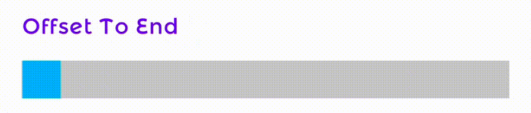

---

2. 动画过程中View由于重组被销毁了，也不需要做任何处理，也不会引发任何异常：
---
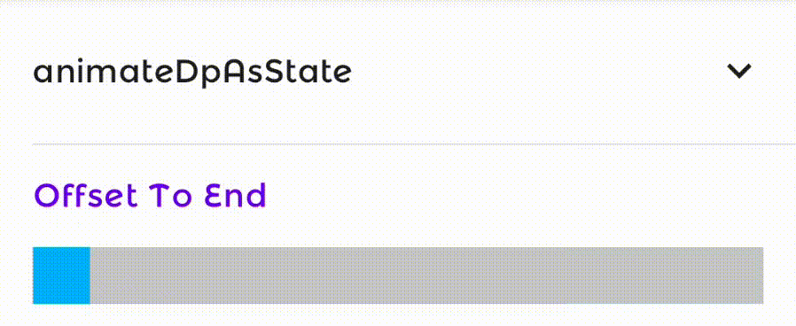

---

不得不说，Compose动画的第一个实践的体验真香，优雅且无负担！

目前我们使用的动画完全是API默认的，API也提供了定制动画规律的参数，先来看看`animateDpAsState`的定义：

```kotlin
@Composable
fun animateDpAsState(
targetValue: Dp,
animationSpec: AnimationSpec<Dp> = dpDefaultSpring, finishedListener: ((Dp) -> Unit)? = null
): State<Dp> { 
    ...
}
```

我们可以通过`animationSpec`定制动画规律，Compose中提供了三种常用的`AnimationSpec`：

- Spring - 在开始值在结束值之间创建基于物理弹簧的动画。
- Tween - 在指定时间内根据缓动曲线在开始值和结束值之间进行补间动画。
- KeyFrames - 在指定时间内，某些特定时间点对应特定值，即关键帧； 两个相邻关键帧之间可以指定缓动曲线。

具体的效果差异可以运行[Compose Animation Demo](https://github.com/ommiao/ComposeAnimation)体验，此处不再赘述。

下面演示两个进阶版动画效果，仅使用`animateDpAsState`API来实现：

###### 线性Progress Bar
> 以固定时间间隔刷新进度，如间隔1s按照以下百分比刷新：0.1f, 0.25f, 0.44f, 0.65f, 0.7f, 0.8f, 0.95f, 1.0f

---
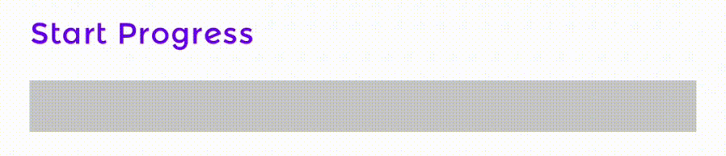

---

###### Animation Chain
> 一组View依次进行相同的动画
---
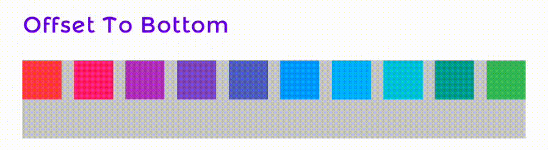

---

##### 示例二、animateColorAsState
> 颜色变化在UI交互中也很常见，并且大家都知道虽然颜色可以用一个16进制值来表示，但是其实是分为RGBA四个通道的，因此颜色的渐变也不是简单的一维数字变化，而是每个通道分别控制。

最初我非常天真地以为颜色渐变就是动态改变16进制颜色值，也就是按照整型将初始值逐渐更新到目标值，得到了如下闪瞎眼的动画效果：

---
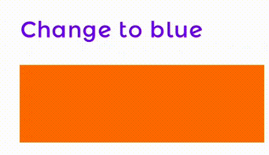

---

而`animateColorAsState`实现的则是我们预期的效果：

---
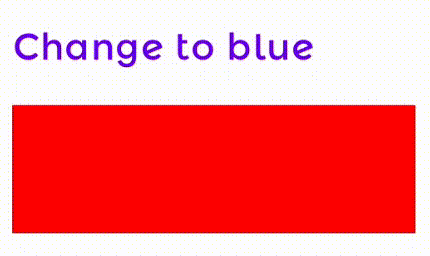

---

`animateColorAsState`的定义：
```kotlin
@Composable
fun animateColorAsState(
    targetValue: Color,
    animationSpec: AnimationSpec<Color> = colorDefaultSpring,
    finishedListener: ((Color) -> Unit)? = null
): State<Color> {
    …
}
```

可以看到，和`animateDpAsState`是十分相似的，`animate*AsState`家族的API定义是高度一致的，唯一的区别是返回的State类型不同。

#### 场景二、View或Layout的可见性变化
> 该场景是指View或Layout的可见性在true和false之间的切换，该场景我们使用AnimatedVisibility。

##### 适用于可见性变化的AnimatedVisibility

`AnimatedVisibility`是一个容器，用于控制内部View/Layout可见性发生变化时的过渡效果。先来看看API定义：

```kotlin
@Composable
fun AnimatedVisibility(
 visible: Boolean,
 modifier: Modifier = Modifier,
 enter: EnterTransition = xxxIn(),
 exit: ExitTransition = xxxOut(),
 content: @Composable AnimatedVisibilityScope.() -> Unit
) {
 …
}
```

其中`visible`指当前可见性的目标状态，`enter`指View/Layout变为可见时的进入效果，`exit`指View/Layout变为不可见的退出效果。

`enter`和`exit`是成对实现的，有如下类型：

1. fadeIn / fadeOut
2. slideIn / slideOut
3. slideInH/V / slideOutH/V
4. scaleIn / scaleOut
5. expandIn / shrinkOut
6. expandH/V / shrinkH/V

---
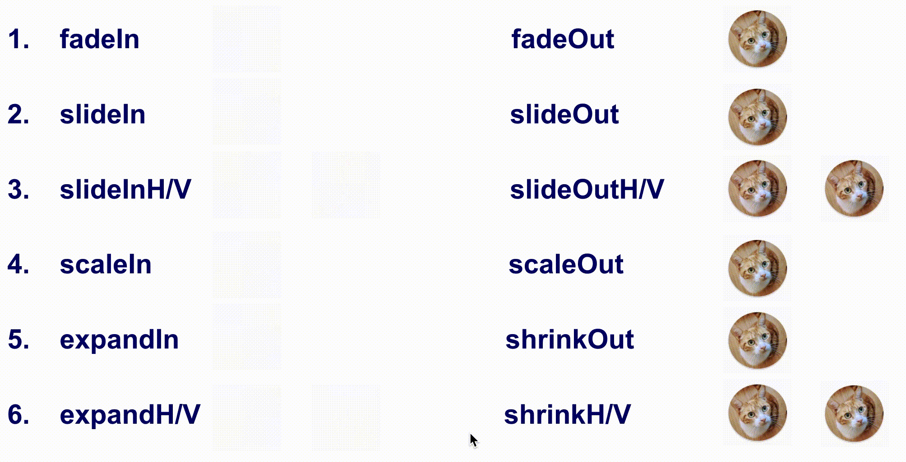

---

通过动画效果预览，我们可以看出绝大部分的动画过程，但有个不易察觉的地方需要注意，`slide`和`expand`的效果乍一看是一样的，但其实`slide`在执行时不会动态改变容器的Size，而`expand`在执行时容器的Size是动态改变的，请看如下的对比：

---
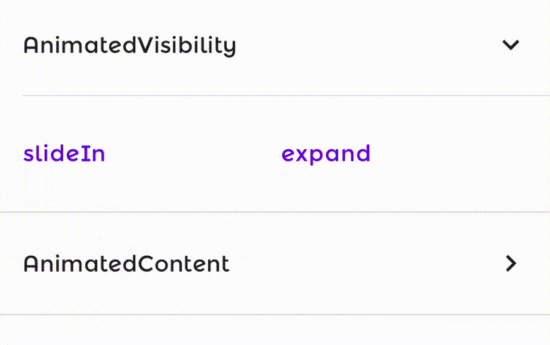

---

熟悉了`AnimatedVisibility`支持的动画效果，就可以随心应用了，但还有个语法糖可以了解一下，即`EnterTransition`是可以使用`+`叠加的，比如可以使用`sildeIn() + fadeIn()`将Offset和Alpha动画进行合并，同理`ExitTransition`也是可以叠加的，用起来就是两个字：舒服！

每个`enter`或`exit`的API都支持`animationSpec`参数，因此场景一里列出的的`animationSpec`在场景二也是适用的。

#### 场景三、View或Layout之间的切换
> 该场景是指两个不同的View或Layout切换，此处的"不同"不仅仅代表两个View或Layout的代码本身不同，也可以是同一个View在不同State下渲染的"不同"，比如Text文字由"1"变为"2"，两次渲染的结果也可以看作是两个不同的View。该场景有两个API，CrossFade和AnimatedContent。

##### 示例一、简单的渐变效果容器Crossfade

Crossfade是一个非常易用的API：
```kotlin
@Composable
fun <T> Crossfade(
 targetState: T,
 modifier: Modifier = Modifier,
 animationSpec: FiniteAnimationSpec<Float> = tween(),
 content: @Composable (T) -> Unit
) {
 …
}
```

`Crossfade`实际上是对View进行alpha属性的变化，`targetState`可是是任意类型，一般可以使用`enum`类型标记UI状态，`animationSpec`则和上文一致，下面来看一个示例：
```kotlin
Crossfade(
    targetState = crossfadeState,
    animationSpec = tween(2000)
) {
    when (it) {
        CrossfadeState.LOADING -> {
            Loading()
        }
        CrossfadeState.SUCCESS -> {
            Success()
        }
        CrossfadeState.ERROR -> {
            Error()
        }
    }
}
```

这段代码实现了`Loading`、`Success`和`Error`状态的渐变切换：

---
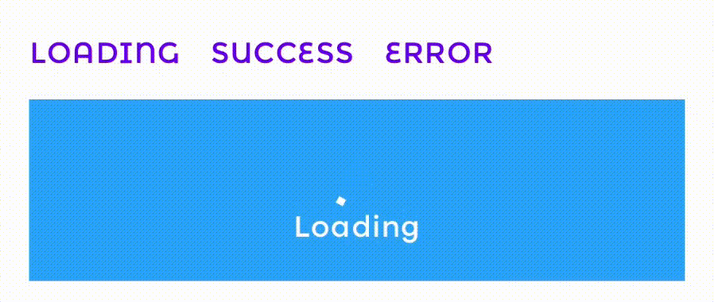

---

Crossfade没有其他使用方式，也没有alpha渐变之外的任何效果，如果有其他需求请使用`AnimatedContent`，`Crossfade`可以看作是`AnimatedContent`的一个具体实例，但在底层实现上二者并没有关系。

##### 示例二、AnimatedContent实现数字切换动画

先来看一段代码：
```kotlin
AnimatedContent(
    targetState = count,
    transitionSpec = {
        if (targetState > initialState) {
            ContentTransform(
                targetContentEnter = slideInVertically { height -> height } + fadeIn(),
                initialContentExit = slideOutVertically { height -> -height } + fadeOut(),
                sizeTransform = SizeTransform(clip = false)
            )
        } else {
            ContentTransform(
                targetContentEnter = slideInVertically { height -> -height } + fadeIn(),
                initialContentExit = slideOutVertically { height -> height } + fadeOut(),
                sizeTransform = SizeTransform(clip = false)
            )
        }
    }
) { target ->
    Text(
        text = "$target",
        textAlign = TextAlign.Center,
        color = Color.White,
        style = MaterialTheme.typography.h3,
        modifier = Modifier.width(100.dp)
    )
}
```

这段代码里只有一个`Text`，并没有明显的View切换，但当`count`变化时，`Text`会重新绘制，这种情况也可以理解为View发生了切换，看看动画效果就更容易理解了：

---
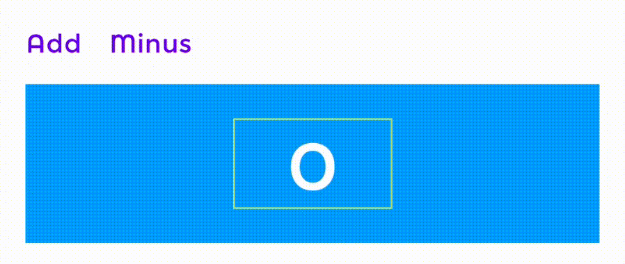

---

所以我们可以理解为，当state发生改变，导致`AnimatedContent`中的UI重绘时，当前的UI会执行退出动画，而新绘制的UI会执行进入动画。

`AnimatedContent`接收的参数是`transitionSpec`，其类型为`() -> ContentTransform`，而我们可以定义一个返回`ContentTransform`的lambda表达式，这样的好处是我们可以根据不同的场景动态返回，比如上述的数字从大到小和从小到大，动画的方向是相反的。

`ContentTransform`主要包含三个参数：
- targetContentEnter - 新UI进入的EnterTransition，可参考场景二
- initialContentExit - 当前UI退出的ExitTransition，亦可参考场景二
- sizeTransform - 控制动画过程中的Size变化以及是否可以超出父级绘制UI（clip=false，在某些场景可能需要溢出父级后依然执行动画）

##### 示例三、AnimatedContent实现不同大小View的切换
```kotlin
AnimatedContent(
    targetState = expanded,
    transitionSpec = {
        ContentTransform(
            targetContentEnter = fadeIn(animationSpec = tween(200, 200)),
            initialContentExit = fadeOut(animationSpec = tween(200)),
            sizeTransform = SizeTransform { initialSize, targetSize ->
                if (targetState) {
                    keyframes {
                        // Expand horizontally first.
                        IntSize(targetSize.width, initialSize.height) at 200
                        durationMillis = 400
                    }
                } else {
                    keyframes {
                        // Shrink vertically first.
                        IntSize(initialSize.width, targetSize.height) at 200
                        durationMillis = 400
                    }
                }
            }
        )
    }
) { targetExpanded ->
    if (targetExpanded) {
        Expanded()
    } else {
        ContentIcon()
    }
}
```

分析一下，首先当前UI的退出动画是`fadeOut`，新UI的进入动画是`fadeIn`，此外Size的变化是如果`expanded=true`，则先将宽度变化到目标值而高度不变，反之`expanded=false`则先将高度变化到目标值而宽度不变：

---
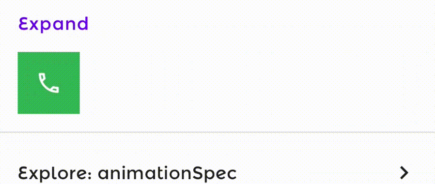

---

#### 总结

本篇文章在介绍Compose Animation时，根据使用场景作为划分，而在官方文档中稍有不同，是根据API定义的高低级别划分，高级别是指直接附带动画的Container，即场景二和场景三部分，低级别是指针对属性指产生动态State，即场景一部分。

不难发现，三个动画场景其实是一脉相承的：

- 场景二中的`AnimatedVisibility`中会使用场景一中的`animationSpec`
- 场景三中的`AnimatedContent`中会使用场景二中的`EnterTransition`和`ExitTransition`

除了上述的三个动画场景，官方文档还有其他API可供参考：

---


---

##### 参考链接

[Compose Animation Demo](https://github.com/ommiao/ComposeAnimation)
[Compose Animation Doc](https://developer.android.com/jetpack/compose/animation)
