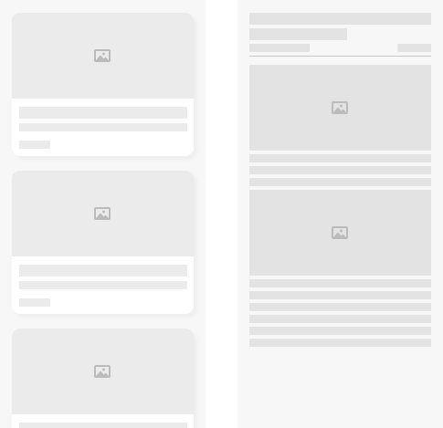
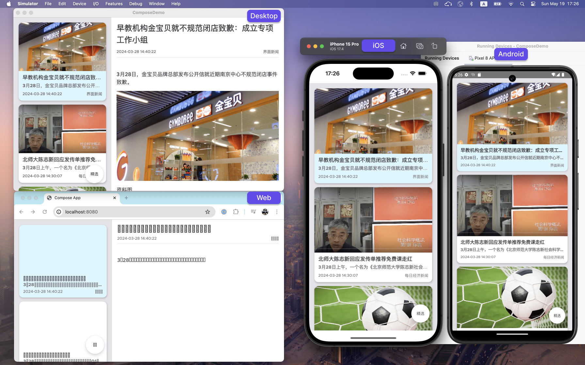

#### （一）心路历程

##### 零、写在前面

[本文AI含量为0]

Jetpack Compose是一个在Android平台被大力推荐的声明式UI框架，正式版发布已经接近3年，记得刚在项目上接触Compose的时候还是beta版本，Compose的简单高效让我在开发工作中非常乐于探索不同的功能和特性。
对于Jetpack Compose的跨平台支持特性我一直都有所关注，但是没有实际应用过，现在Compose已经达到了足够高的稳定性和易用性，我也在跨平台的Compose应用上做出了第一次实践。

在切入正文之前，我要强调的事情是，我并不是一个跨平台开发者，对于iOS，Desktop以及Web平台，我只是有一些简单的仅限于基础知识层面的了解，没有任何深入的开发经验，所以对我而言，要想开发一个跨平台的应用，本身就是一个很大的挑战。

本篇文章仅分享一些主观感受和想法，Jetpack Compose跨平台开发技术请看下篇-开发手记。

##### 一、实践初衷
在Android平台的应用开发中，我已经进行了足够多的Compose编程实践，对于Compose的各种组件和开发模式有足够的了解，我非常看好Compose对于Android开发者编程体验的提升，同时我也在持续关注Jetpack Compose的Roadmap，Compose的功能迭代非常迅速。
既然Jetpack Compose在Android平台如此出色，并且Compose在设计之初就面向跨平台，我也想试试Compose在其他平台能有怎样的体验。

##### 二、实践目的
相信每个开发者在接触一门新技术的时候，第一个项目大多都是`Hello World`。
做到这一步显然不是我的目的，我想探究的是Jetpack Compose跨平台体验，那么最好还是能从实际需求出发，做一个有一些实际功能并且达到可用程度的App，最好能涉及到一些网络请求、图片加载等功能来提高开发的复杂度。
除了业务需求之外，我制定的一个规则是开发中使用纯粹的跨平台方案实现，尽量不引入特定平台的实现，我想知道纯粹的跨平台实现完成度有多少。（当然，还有个很大的原因是，如果涉及到特定平台的实现，我可能写不出来）

最终我想到的需求是做一个新闻客户端App，包含列表和详情页面，分为窄屏和宽屏两个场景：

窄屏场景下，采用两个独立页面，默认显示新闻列表页面，点击新闻卡片切换到文章详情页面：

宽屏场景下，只有一个页面，左侧显示文章列表，右侧显示新闻详情：

总结一下我想实现的需求：
1. 面向Android、iOS、Desktop和Web四个平台
2. 使用纯粹的跨平台实现，尽量不针对特定平台编写代码
3. 使用响应式布局适配不同尺寸的屏幕
4. 实现网络请求、图片加载等较为复杂的功能
5. 适配Dark Mode，提供流畅优雅的用户体验

##### 三、成果展示

先来一张全平台演示图：

【注：Web端Compose尚在实验阶段，中文无法正常显示，并且加载网络图片也遇到了问题】

然后是在不同平台设备上的响应式布局，这里我演示了PC端调整窗口大小以及在Mobile端切换横竖屏的效果，请看演示视频：
响应式布局演示视频：[On Desktop](https://drive.google.com/file/d/1gBDsZ_fBSHwqGogS0_QLOAJ7QbmaW3iu/view?usp=sharing) | [On Mobile](https://drive.google.com/file/d/1Cq3oykErf54ZoBb-HRC8BHE-xPp-zdGC/view?usp=sharing)

最后展示一下Dark Mode的支持情况，为了直观地看到切换Dark Mode时的体验，请看演示视频：
Dark Mode演示视频：[Dark Mode](https://drive.google.com/file/d/1MWuVvP5edpcTs9g7RMHKu6kjEnb8WyzB/view?usp=sharing)

##### 四、体验报告
经过一系列环境搭建、文档查阅和参考各种Compose跨平台的Example之后，终于实现了预期的功能，但比想象中要困难很多，甚至在中途有过放弃某些feature的想法。

**WELL：**
1. 开发环境搭建比较简单，Android Studio和Xcode都可以傻瓜式安装，并且官方提供了[KDoctor](https://github.com/Kotlin/kdoctor)工具，可以一键检查开发环境是否完善可用。
2. Compose开发直接在Android Studio中进行，对Android开发者十分友好。
3. Compose基础功能比较完善，比如State驱动UI、页面元素动画、使用kotlin协程、以及Dark模式检测等功能都能很好地支持。
4. 对平台差异有比较好的抽象，比如尺寸单位在不同的平台上可能对应px、em、pt等不同的逻辑概念，在Compose中统一为dp，此外一些图片、字体资源也有统一的定义方式，不需要针对不同平台进行差异化处理。
5. 支持Kotlin Multiplatform的第三方库越来越多，涵盖了存储、网络、测试、绘制等各个方面，详情可见[汇总列表](https://github.com/terrakok/kmp-awesome)。

**LESS WELL：**
1. Web端的支持程度比预想中差很多，目前Web平台被标注为实验性功能，甚至基本的文字显示、网络请求都还存在问题。
2. 有些平台差异必须针对特定平台处理，比如在Web上访问网络图片会遇到跨域问题，虽然这是个浏览器常见问题，但是会让跨平台编程体验变得割裂。
3. Kotlin跨平台项目有很多Example，但不同的Example有着不同的项目结构pattern，应该是基于不同Kotlin Multiplatform版本创建的，这不但增加了学习成本，也可能会增加项目后续的维护成本。
4. 第三方库的平台支持范围参差不齐，并不是全都支持全平台，有时候找到一个适合自己项目的支持库并不容易。

##### 五、总结展望
整体来讲，使用Compose跨平台的编程体验是比较舒适的，如果仅考虑UI部分，可以说基本是没有障碍的，但是距离能在正式项目中被使用还有很长的路要走。
作为Android开发者，不妨幻想一下：在Android端学好Compose，说不定哪天就可以在全平台使用了，只要Compose官方足够给力，躺着就能变成全栈开发不是梦！

如果让我来推荐Compose跨平台技术是否值得了解和学习，我给Android开发者的推荐学习指数是：
★★★★★★☆☆☆☆

给其他技术栈开发者的推荐学习指数是：
★★★☆☆☆☆☆☆☆

#### （二）开发手记