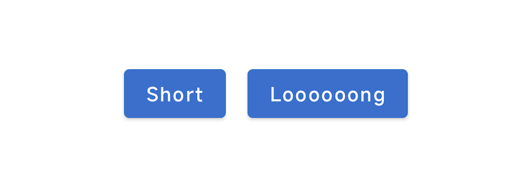
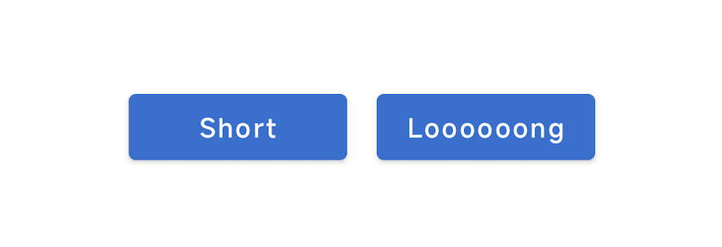
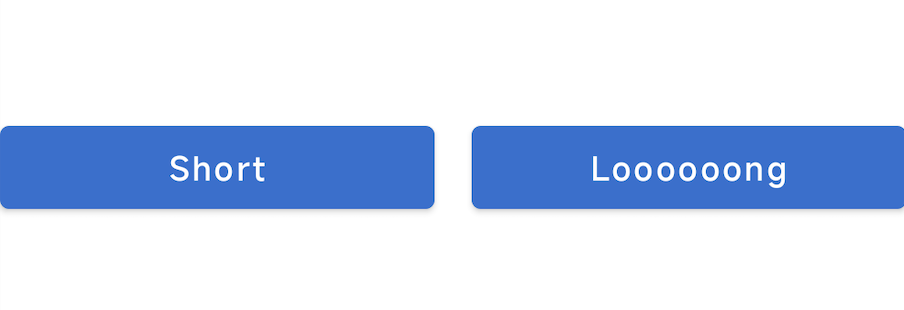

最近遇到一个平平无奇的需求，但在实现的时候却遇到了不少问题，值得记录一下。

需求是这样的，在Compose Row中有两个文字Button，文字内容不同因此宽度也可能不同，如下：

---



---

想要实现的效果是两个Button的宽度一致，如下：

---



---
### Option 1：固定宽度

看到这里可能有人会说了，这有什么难的，直接通过Modifier设置同样的宽度不就搞定了吗？

```kotlin
Button(modifier = Modifier.width(120.dp)){
    Text(text = "...")
}
```

---


---

确实在大多数情况下是可以的。但问题出在Button内部的Text的宽度并不是完全固定的，如果用户在系统设置了调整了文字大小，那么给定的宽度有可能不足以展示文字，导致文字被省略或者换行显示，效果如下：


---


---

### Option 2：最小宽度
既然固定宽度可能会导致Text空间不足，那么设置最小宽度呢？
直接放答案吧，设置最小宽度确实可以解决换行的问题，但是却又违背了最初的需求--两个Button宽度一致，因为在实际宽度超过最小宽度时，两个Button的宽度也就会根据不同文字内容动态扩展了，如下：


---


---

### Option 3：设置相同weight
Compose Row支持给每个子元素设置weight，那么我们给两个Button设置同样的weight能否实现宽度一致的需求呢？
在实际进行测试之前，我也很期待，但是结果并不美好，Button的宽度确实一致了，但是会把整个Row的剩余空间全部充满：

---



---

**上面的方案都是Compose API可以直接支持的，但都不能满足需求。**

仔细思考一下，如果要实现这个需求，我们最好能够明确知道宽度比较大的Button的宽度到底是多少，有了这个数字，我们给另外一个Button设置同样的宽度即可。
所以问题就转换成了如何获取到一个具体的Compose组件的宽度。

Modifier有个`onPlaced`方法，这个方法可以返回当前组件在被渲染时的Size，没错，这就是我们想要的！
实现代码如下：
```kotlin
var buttonWidth by remember {
    mutableStateOf(0)
}
val buttonWidthDp = with(LocalDensity.current) {
    buttonWidth.toDp()
}
Row(
    horizontalArrangement = Arrangement.spacedBy(16.dp)
) {
    Button(
        modifier = Modifier.width(buttonWidthDp),
        onClick = { }
    ) {
        Text(text = "Short")
    }
    Button(
        modifier = Modifier.onPlaced { buttonWidth = it.size.width },
        onClick = { }
    ) {
        Text(text = "Looooooong")
    }
}
```
简单说明一下，首先我们使用state记录buttonWidth，但在onPlaced之前我们并不能确定这个数字，因此buttonWidth的初始值一定是不准确的，在buttonWidth从初始值变成实际值的时候，有概率能看到左侧button会有闪动的问题。

那么我们怎么能在Compose组件渲染之前拿到Size呢？

Google给出了答案：SubcomposeLayout()，以下是直接复制的代码：

```kotlin
@Composable
fun ViewWidthMeasureLayout(
    modifier: Modifier,
    viewToMeasure: @Composable () -> Unit,
    content: @Composable (width: Dp) -> Unit
) {
    SubcomposeLayout(modifier) { constraints ->
        val width =
            subcompose("viewToMeasure", viewToMeasure)[0]
                .measure(Constraints()).width.toDp()
        val contentPlaceable = subcompose("content") {
            content(width)
        }[0].measure(constraints)
        layout(contentPlaceable.width, contentPlaceable.height) {
            contentPlaceable.place(0, 0)
        }
    }
}
```

SubcomposeLayout允许执行一个Composable方法，获取测量信息，但可以选择不去把它显示出来，其中viewToMeasure作为用于测量的Compose组件，而在真正的layout环节，却并不将viewToMeasure进行place操作，place即是将组件放置在layout的某个位置，不进行place就不会渲染这个组件。

再来看看如何使用：
```kotlin
ViewWidthMeasureLayout(
    modifier = Modifier.align(Alignment.Center),
    viewToMeasure = {
        Button(onClick = { }) {
            Text(text = "Loooooong")
        }
    }
) { width ->
    Row(horizontalArrangement = Arrangement.spacedBy(16.dp)){
        Button(modifier = Modifier.width(width), onClick = { }) {
            Text(text = "Short")
        }
        Button(onClick = { }) {
            Text(text = "Loooooong")
        }
    }
}
```

可以看到，使用的时候还是有些麻烦的：
1. 用于测量的Button同时也是用于显示的，我们需要写两次。
2. 如果另外一个Button文字变成较长的那个，我们需要传递另一个Button作为测量View，后期维护的成本很大。


既然知道了原理，那就来定制一个可以获取最大子元素宽度的Row，这样就可以一劳永逸了。

实现代码：
```kotlin
@Composable
fun SameItemWidthRow(
    modifier: Modifier,
    horizontalArrangement: Arrangement.Horizontal,
    content: @Composable (maxItemWidth: Dp) -> Unit
) {
    SubcomposeLayout(modifier) { constraints ->
        val maxItemWidth =
            subcompose("viewToMeasure") {
                content(Dp.Unspecified)
            }.maxOfOrNull {
                it.measure(Constraints()).width.toDp()
            } ?: Dp.Unspecified

        val contentPlaceable = subcompose("content") {
            Row(
                horizontalArrangement = horizontalArrangement
            ) {
                content(maxItemWidth)
            }
        }[0].measure(constraints)
        layout(contentPlaceable.width, contentPlaceable.height) {
            contentPlaceable.place(0, 0)
        }
    }
}
```

这里我们遍历测量所有的子元素，找到最大的宽度，然后将其传递出去作为所有子元素的宽度。注意，我们只需要传递一次子元素，他们先被用于测量，然后再被用于绘制，用于测量时我们假定子元素的宽度是Dp.Unspecified，这样可以让子元素不受限制地测量真实宽度。

使用体验：
```kotlin
 SameItemWidthRow(
    horizontalArrangement = Arrangement.spacedBy(16.dp)
) { maxItemWidth ->
    Button(modifier = Modifier.width(maxItemWidth), onClick = { }) {
        Text(text = "Short")
    }
    Button(modifier = Modifier.width(maxItemWidth), onClick = { }) {
        Text(text = "Loooooong")
    }
}
```

现在我们既实现了需求，又让代码简单得像原来的Row一样了。

### 写在最后
在实现这个需求的时候，有个前提是所有子元素的宽度之和不能超过Row的宽度，如果不能满足这一点的话，也就不能让每个子元素等宽了，如果强制等宽，使用上面的解决方案会导致最后的元素渲染时实际宽度不足，还是无法满足宽度一致的需求。不过如果是这种情况，也没有其他的解决方案了，只能修改设计😄。
