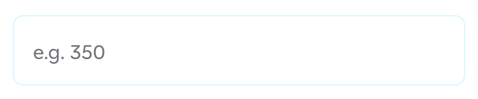
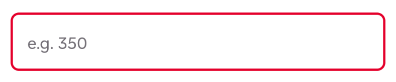
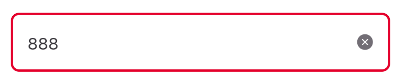

## View体系

##### 1. [TextInputLayout](https://material.io/components/text-fields/android)
###### 去除floating label但保留placeholder
```xml
<com.google.android.material.textfield.TextInputLayout
    ...
    app:hintEnabled="false">

    <com.google.android.material.textfield.TextInputEditText
        ...
        android:hint="e.g. 350"/>

</com.google.android.material.textfield.TextInputLayout>
```

default：

focused：

typed:


###### 更改选择文字游标颜色
```xml
<!-- define a style -->
<style name="ColoredHandleTheme">
    <item name="colorControlActivated">@android:color/black</item>
</style>

<!-- set up theme -->
<com.google.android.material.textfield.TextInputLayout
    ...>

    <com.google.android.material.textfield.TextInputEditText
        ...
        android:theme="@style/ColoredHandleTheme"/>

</com.google.android.material.textfield.TextInputLayout>
```

##### 2. TextView
###### 设置lineHeight-多行文字
```xml
<TextView
    ...
    android:textSize="16sp"
    android:lineSpacingMultiplier="0"
    android:lineSpacingExtra="24sp" />
```

###### 设置lineHeight-单行文字
根据Google官方文档解释，文字最后一行`lineSpacingExtra`不生效，因此单行文字也不生效，所以可以通过以下方式设置：
```xml
<TextView
    ...
    android:layout_width="24sp"
    android:gravity="center_vertical"
    android:textSize="16sp" />
```
